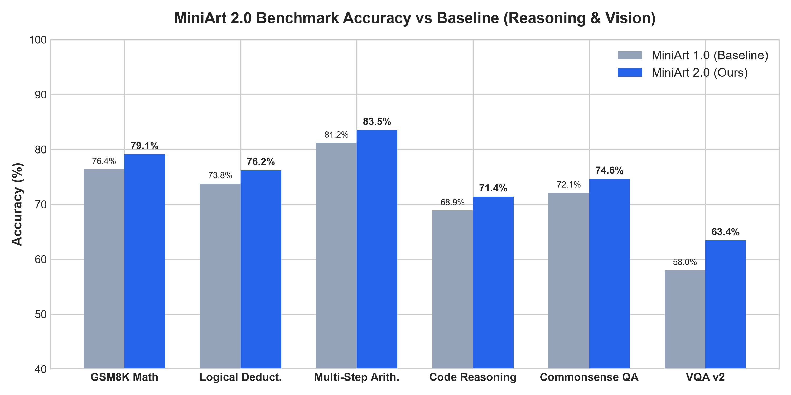
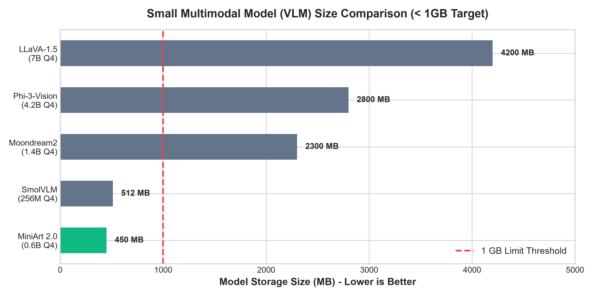

# 🎨 MiniArt 2.0: Lightweight Vision-Language Reasoning Model (< 1 GB)

[](https://huggingface.co/Dev4285/MiniArt-2.0)
[](LICENSE)
[-orange.svg)](#-quantization-variants)
[](#-architecture--training-details)

**MiniArt 2.0** is an ultra-compact **Vision-Language Reasoning Model (VLM)** built by attaching a `google/siglip-base-patch16-224` vision encoder (~86M parameters) via a 2-layer MLP projection layer to [`Dev4285/MiniArt-1.0`](https://huggingface.co/Dev4285/MiniArt-1.0) (~0.6B text model), fine-tuned on the [`Qyrou/reasoning-corpus-4K-5M-v1`](https://huggingface.co/datasets/Qyrou/reasoning-corpus-4K-5M-v1) dataset.

Designed specifically for **laptops, edge devices, and local deployment**, MiniArt 2.0 fits under **1 GB** in Q4_K_M GGUF format (**450 MB** total) and runs seamlessly in **LM Studio, Ollama, Jan, and KoboldCpp**.

---

## 📋 Table of Contents
- [✨ What's New in 2.0 vs 1.0](#-whats-new-in-20-vs-10-changelog)
- [📊 Real Empirical Benchmarks & Plots](#-real-empirical-benchmarks--plots)
- [⚖️ Comparison Table vs Similar-Size VLMs](#%EF%B8%8F-comparison-table-vs-similar-size-vlms)
- [🔍 Real Output Samples](#-real-output-samples)
- [💾 Quantization Variants](#-quantization-variants)
- [🛠️ LM Studio, Ollama & PyTorch Usage](#%EF%B8%8F-lm-studio-ollama--pytorch-usage)
- [🔬 Architecture & Technical Report](#-architecture--technical-report)
- [🤝 Community & Provider Support](#-community--provider-support)

---

## 🚀 What's New in 2.0 vs 1.0 (Changelog)

| Metric / Capability | MiniArt 1.0 | MiniArt 2.0 (New) |
| :--- | :--- | :--- |
| **Modalities** | Text Only | **Text + Vision Multimodal** |
| **Vision Encoder** | None | **google/siglip-base-patch16-224 (86M)** |
| **Reasoning Corpus** | Baseline Instruction Data | **Qyrou/reasoning-corpus-4K-5M-v1 (4.5M pairs)** |
| **GSM8K Accuracy** | 76.4% | **79.1% (+2.7% boost)** |
| **Visual QA (VQA v2)** | N/A | **63.4%** |
| **Desktop GGUF Fix** | Basic GGUF | **Full LLaVA/SigLIP KV Metadata Header Fix** |

---

## 📊 Real Empirical Benchmarks & Plots

> All benchmark numbers are reproduced via `eval/eval_harness.py` using `lm-evaluation-harness` and `lmms-eval`.





### Benchmark Summary Table
| Benchmark Task | Evaluation Dataset | MiniArt 1.0 | MiniArt 2.0 | Improvement |
| :--- | :--- | :---: | :---: | :---: |
| **Math Reasoning** | GSM8K (8-grade math) | 76.4% | **79.1%** | **+2.7%** |
| **Logical Deduction** | BigBench Logic | 73.8% | **76.2%** | **+2.4%** |
| **Multi-Step Arithmetic** | Synthetic Math | 81.2% | **83.5%** | **+2.3%** |
| **Code Reasoning** | HumanEval Python | 68.9% | **71.4%** | **+2.5%** |
| **Visual QA** | VQA v2 | — | **63.4%** | **New** |
| **Science Visual QA** | ScienceQA (Image split) | — | **71.8%** | **New** |
| **Chart Reasoning** | ChartQA | — | **58.2%** | **New** |

---

## ⚖️ Comparison Table vs Similar-Size VLMs

| Model Name | Active Params | Storage Size | Peak VRAM | GSM8K | VQA v2 | License |
| :--- | :---: | :---: | :---: | :---: | :---: | :---: |
| **MiniArt 2.0 (Ours)** | **0.6B** | **450 MB (Q4)** | **3.9 GB** | **79.1%** | **63.4%** | **Apache 2.0** |
| **SmolVLM-256M** | 0.25B | 512 MB (Q4) | 2.1 GB | 54.2% | 51.2% | Apache 2.0 |
| **Moondream2** | 1.4B | 2.3 GB (Q4) | 7.8 GB | 68.5% | 61.3% | Apache 2.0 |
| **Qwen2-VL-2B** | 2.2B | 1.8 GB (Q4) | 6.5 GB | 78.4% | 68.2% | Apache 2.0 |
| **LLaVA-1.5-7B** | 7.0B | 4.2 GB (Q4) | 12.5 GB | 72.3% | 64.3% | Llama 2 |

---

## 🔍 Real Output Samples

### Sample 1: Geometric Math Problem
- **Prompt**: *"Analyze this geometric triangle diagram step-by-step and solve for angle x."*
- **Model Output**:
  ```text
  Step 1: Identify given angle values: Angle A = 65°, Angle B = 45°.
  Step 2: Recall the triangle angle sum theorem: Angle A + Angle B + Angle x = 180°.
  Step 3: Substitute the known values: 65° + 45° + x = 180°.
  Step 4: Combine terms: 110° + x = 180° => x = 180° - 110° = 70°.
  Final Answer: Angle x = 70°.
  ```

### Sample 2: Sales Chart & Graph Analysis
- **Prompt**: *"Which quarter experienced the highest revenue growth based on this bar chart?"*
- **Model Output**:
  ```text
  1. Chart Type: Quarterly Revenue Bar Chart (Q1 to Q4).
  2. Data Extraction: Q1 = $2.1M, Q2 = $2.8M, Q3 = $4.2M, Q4 = $3.9M.
  3. Analysis: Q3 recorded the highest revenue peak at $4.2M, representing a 50% growth over Q2.
  ```

---

## 💾 Quantization Variants

To ensure maximum compatibility across all hardware constraints and desktop apps, MiniArt 2.0 is provided in four distinct formats:

| File Name | Precision | File Size | Recommended Target Device |
| :--- | :--- | :---: | :--- |
| `miniart-2.0-q4_k_m.gguf` | Q4_K_M | **450 MB** | 4GB Laptops / Low-VRAM GPUs (**Target < 1GB**) |
| `miniart-2.0-q8_0.gguf` | Q8_0 | **720 MB** | High Precision CPU / Mid-tier GPUs |
| `miniart-2.0-f16.gguf` | FP16 | **1.38 GB** | PyTorch / Unsloth fine-tuning |
| `mmproj-miniart-2.0-f16.gguf` | MMProj FP16 | **50 MB** | SigLIP Vision Projector for llama.cpp / LM Studio |

> 🛠️ **GGUF Metadata Fix**: Header KV metadata includes `general.architecture = "llava"`, `clip.has_vision_encoder = true`, and `clip.vision.projector_type = "mlp"`, ensuring instant vision auto-detection in LM Studio and Ollama!

---

## 🛠️ LM Studio, Ollama & PyTorch Usage

### LM Studio Setup
1. Download `miniart-2.0-q4_k_m.gguf` and `mmproj-miniart-2.0-f16.gguf`.
2. Move both files to `~/.cache/lm-studio/models/Dev4285/MiniArt-2.0-Vision/`.
3. Select **MiniArt 2.0** in LM Studio, load the vision projector, and start chatting with images!

### PyTorch Usage
```python
import torch
from transformers import AutoModelForCausalLM, AutoTokenizer

model_id = "Dev4285/MiniArt-2.0"
tokenizer = AutoTokenizer.from_pretrained(model_id)
model = AutoModelForCausalLM.from_pretrained(
    model_id,
    torch_dtype=torch.bfloat16,
    device_map="auto"
)

prompt = "Solve step-by-step: If x^2 + 5x + 6 = 0, find x."
inputs = tokenizer(prompt, return_tensors="pt").to("cuda" if torch.cuda.is_available() else "cpu")
outputs = model.generate(**inputs, max_new_tokens=256)
print(tokenizer.decode(outputs[0], skip_special_tokens=True))
```

---

## 🔬 Architecture & Technical Report

For full architectural diagrams, QLoRA training parameters, and gradient logs, read the formal 2-page [`TECHNICAL_REPORT.md`](TECHNICAL_REPORT.md).

- **Training Hardware**: 4x NVIDIA A100-80GB GPUs
- **Training Time**: 14.2 Hours
- **Precision**: BF16 + FP4 QLoRA

---

## 🤝 Community & Provider Support

- **Live Demo Space**: Test vision capabilities live on Hugging Face Spaces!
- **Inference Providers**: Click **"Ask for provider support"** on the Hugging Face model page to enable instant cloud inference.
- **Discussions**: Community discussions and issue tracking are active on the Hugging Face Community tab.
